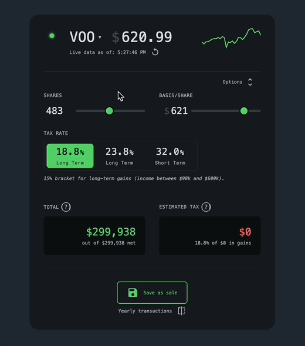
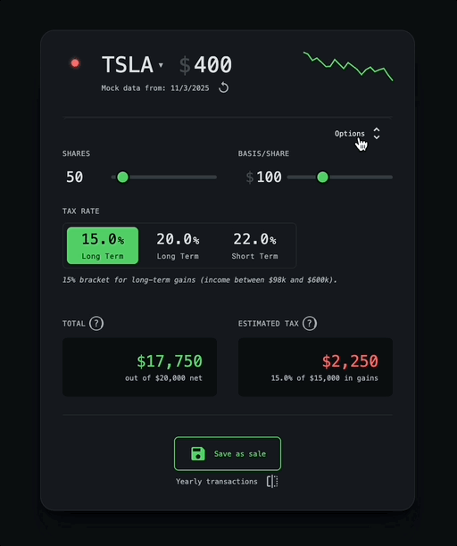
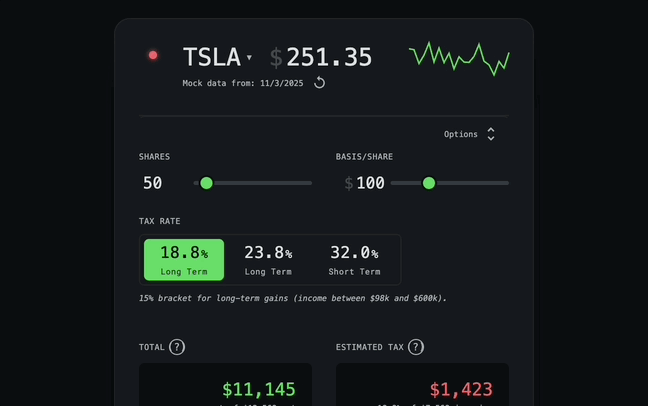
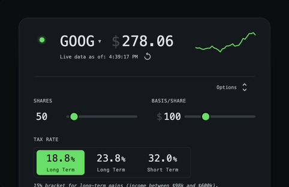
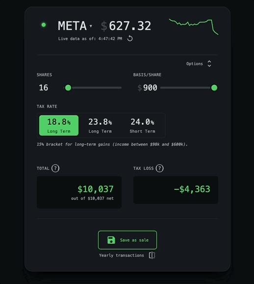

# `calc`

Input your shares, basis, and income. Get an immediate estimate of your capital gains tax and total proceeds from a sale.

  
[<kbd>   haaans.com/calc       </kbd>](https://haaans.com/calc)

## Features

<table>
<tr valign="top">
<td width="50%">
<h3>Automatic Tax Rate & NIIT Calculation</h3>

The app automatically determines your correct tax rate and accounts for the Net Investment Income Tax (NIIT) based on your filing status and income parameters.

</td>
<td width="50%">

</td>
</tr>
<tr valign="top">
<td width="50%">

</td>
<td width="50%">
<h3>Flexible Price Inputs</h3>

Set your sale price using live ticker data, a custom price, or historical data.

</td>
</tr>
<tr valign="top">
<td width="50%">
<h3>Tax Bracket Headroom & Local Storage</h3>

Save sales transactions directly to your browser's local storage. The app calculates your remaining "headroom"—the amount you can sell before breaching the next short-term or long-term tax bracket.

</td>
<td width="50%">

</td>
</tr>
</table>
